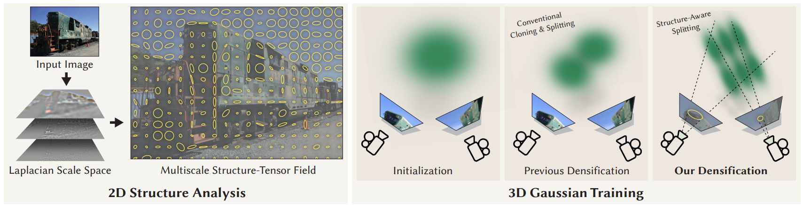

# Faster 3D Gaussian Splatting Convergence via Structure-Aware Densification

SIGGRAPH 2026 Conference Track

[Project page](https://vcai.mpi-inf.mpg.de/projects/SAD-GS/)

This repository contains the code for **Faster 3D Gaussian Splatting Convergence via Structure-Aware Densification**.
The method accelerates 3D Gaussian Splatting convergence by using multiscale image structure to guide Gaussian
densification. Instead of relying only on screen-space positional gradients, it compares each Gaussian's projected
screen-space extent with local texture structure, then performs anisotropic splitting with multiview consistency.



## Authors

[Linjie Lyu](https://linjielyu.github.io/),
[Ayush Tewari](https://ayushtewari.com/),
[Jianchun Chen](https://jcjackch.github.io/),
[Thomas Leimk&uuml;hler](https://people.mpi-inf.mpg.de/~tleimkue/), and
[Christian Theobalt](https://people.mpi-inf.mpg.de/~theobalt/)

Max Planck Institute for Informatics, Cambridge University, and Saarbr&uuml;cken Research Center for Visual Computing,
Interaction, and Artificial Intelligence (VIA).

## Installation

Create and activate a conda environment:

```bash
conda create -n sadgs python=3.12 -y
conda activate sadgs
```

Install PyTorch and the Python dependencies:

```bash
pip install torch torchvision torchaudio --index-url https://download.pytorch.org/whl/cu121
pip install plyfile tqdm websockets
```

Install the local CUDA/C++ extensions:

```bash
pip install submodules/diff-gaussian-rasterization_structgs
pip install submodules/simple-knn
pip install submodules/fused-ssim
```

If your CUDA toolkit or driver stack differs from CUDA 12.1, install the matching PyTorch build from the official
PyTorch instructions before installing the local extensions.

## Datasets

The training script expects datasets in the same directory layout used by the original 3D Gaussian Splatting
benchmarks:

```text
/path/to/datasets/360_v2/
  bicycle/
  bonsai/
  counter/
  flowers/
  garden/
  kitchen/
  room/
  stump/
  treehill/

/path/to/datasets/tandt_db/db/
  drjohnson/
  playroom/

/path/to/datasets/tandt_db/tandt/
  train/
  truck/
```

Each scene should contain the standard COLMAP/benchmark files and an `images` directory.

The MipNeRF360 scenes are hosted by the paper authors [here](https://jonbarron.info/mipnerf360/). You can find the
SfM data sets for Tanks&Temples and Deep Blending
[here](https://repo-sam.inria.fr/fungraph/3d-gaussian-splatting/datasets/input/tandt_db.zip).

## Run

Training commands are collected in [`run_train.sh`](run_train.sh). All numbers reported in the paper are produced by
this script.

Note that we use different hyperparameters for different dataset types, such as indoor and outdoor scenes. For new
scenes, please refer to `run_train.sh` for possible hyperparameter settings.

Before running it, edit the placeholders at the top of the file or export them in your shell:

```bash
export PROJECT_ROOT=/path/to/SADGS
export MIPNERF360_DATASET=/path/to/datasets/360_v2
export TANDT_DB_DATASET=/path/to/datasets/tandt_db/db
export TANDT_DATASET=/path/to/datasets/tandt_db/tandt
export CUDA_VISIBLE_DEVICES=0
```

Then launch:

```bash
bash run_train.sh
```

The script trains, renders, and evaluates the configured scenes. Outputs are written under `output/<scene>`.

To run a smaller subset, edit the scene arrays near the bottom of `run_train.sh`.

## Acknowledgements

This project is built upon [3DGS](https://github.com/graphdeco-inria/gaussian-splatting) and
[FastGS](https://github.com/fastgs/FastGS). We extend our gratitude to all the authors for their outstanding
contributions and excellent repositories.

**License**: Please adhere to the licenses of 3DGS.

## Citation

```bibtex
@inproceedings{lyu2026faster,
  author = {Lyu, Linjie and Tewari, Ayush and Chen, Jianchun and Leimk{\"u}hler, Thomas and Theobalt, Christian},
  title = {Faster 3D Gaussian Splatting Convergence via Structure-Aware Densification},
  booktitle = {Special Interest Group on Computer Graphics and Interactive Techniques Conference Conference Papers},
  series = {SIGGRAPH Conference Papers '26},
  year = {2026},
  month = jul,
  location = {Los Angeles, CA, USA},
  publisher = {Association for Computing Machinery},
  address = {New York, NY, USA},
  isbn = {979-8-4007-2554-8},
  doi = {10.1145/3799902.3811212},
  url = {https://doi.org/10.1145/3799902.3811212},
  numpages = {10}
}
```
